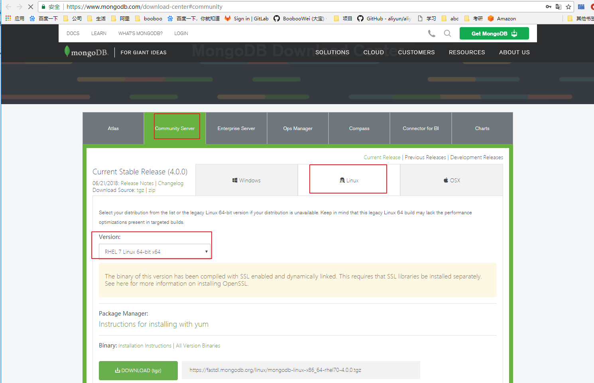

# MongoDB单实例安装

[TOC]


## MongoDB 下载

MongoDB提供了可用于32位和64位系统的预编译二进制包，你可以从MongoDB官网下载安装，MongoDB预编译二进制包下载地址：http://www.mongodb.org/downloads




## 实验环境为rhel7.2 mongodb 3.4.1

mastera	192.168.196.11

1.下载到本地并解压

安装指南可以查看压缩后的README 

```
[root@mastera ~]# cd /tmp
[root@mastera tmp]# ls
mongodb-linux-x86_64-rhel70-3.4.1.tgz  mysql_scripts.zip
[root@mastera tmp]# tar -xf mongodb-linux-x86_64-rhel70-3.4.1.tgz -C /usr/local/
[root@mastera tmp]# cd /usr/local
[root@mastera local]# ls
bin  etc  games  include  lib  lib64  libexec  mongodb-linux-x86_64-rhel70-3.4.1  sbin  share  src
[root@mastera local]# cd mongodb-linux-x86_64-rhel70-3.4.1/
[root@mastera mongodb-linux-x86_64-rhel70-3.4.1]# ls
bin  GNU-AGPL-3.0  MPL-2  README  THIRD-PARTY-NOTICES
[root@mastera mongodb-linux-x86_64-rhel70-3.4.1]# ln -s /usr/local/mongodb-linux-x86_64-rhel70-3.4.1/ /usr/local/mongodb
[root@mastera mongodb-linux-x86_64-rhel70-3.4.1]# cd /usr/local/mongodb
[root@mastera mongodb]# pwd
/usr/local/mongodb
```

2.将可执行文件路径加入PATH变量中，并永久生效

```shell
[root@mastera mongodb]# echo "export PATH=$PATH:/usr/local/mongodb/bin" >> /etc/bashrc
[root@mastera mongodb]# source /etc/bashrc
[root@mastera mongodb]# ls bin
bsondump  mongo  mongod  mongodump  mongoexport  mongofiles  mongoimport  mongooplog  mongoperf  mongoreplay  mongorestore  mongos  mongostat  mongotop
[root@mastera mongodb]# which mongo
/usr/local/mongodb/bin/mongo
```

3.创建数据库目录和日志目录

MongoDB 默认的启动的数据库路径是 /data/db 。

```shell
[root@mastera mongodb]# mkdir /mongodb/data/db -p
[root@mastera mongodb]# mkdir /mongodb/data/log -p
```

4.运行 MongoDB 服务

1)命令行参数运行 MongoDB 服务

可以在命令行中执行mongo安装目录中的bin目录执行mongod命令来启动mongdb服务。

--dbpath 指定数据路径

--logpath 指定日志路径

--logappend 指定日志追加

--port 指定监听端口

```shell
[root@mastera mongodb]# mongod --dbpath /mongodb/data/db/ --logpath /mongodb/data/log/mongodb.log --logappend &
[1] 1714
```

这里有四个警告
1. 访问权限问题
2. 进程执行用户为root问题
3. 内核参数/sys/kernel/mm/transparent_hugepage/enabled
4. 内核参数/sys/kernel/mm/transparent_hugepage/defrag

```shell
[root@mastera mongodb]# cat /sys/kernel/mm/transparent_hugepage/enabled
[always] madvise never
[root@mastera mongodb]# echo never > /sys/kernel/mm/transparent_hugepage/enabled
[root@mastera mongodb]# cat /sys/kernel/mm/transparent_hugepage/enabled
always madvise [never]
[root@mastera mongodb]# echo never > /sys/kernel/mm/transparent_hugepage/defrag 
[root@mastera mongodb]# cat /sys/kernel/mm/transparent_hugepage/defrag 
always madvise [never]
```

查看守护进程为mongod，监听端口为27017

```shell
[root@mastera mongodb]# ps -ef|grep mongo
root       1714   1585  0 21:50 pts/0    00:00:00 mongod --dbpath /mongodb/data/db/ --logpath /mongodb/data/log/mongodb.log --logappend
root       1736   1585  0 21:51 pts/0    00:00:00 grep --color=auto mongo
[root@mastera mongodb]# netstat -luntp|grep mongo
tcp        0      0 0.0.0.0:27017           0.0.0.0:*               LISTEN      1714/mongod 
```

2)配置文件启动 MongoDB 服务

新建配置文件存放路径/mongodb/mongodb.cnf

```shell
[root@mastera mongodb]# vim /mongodb/mongodb.cnf
dbpath=/mongodb/data/db
logpath=/mongodb/data/log/mongodb.log
logappend=true
port=27017
[root@mastera mongodb]# mongod -f /mongodb/mongodb.cnf &
[1] 1762
[root@mastera mongodb]# ps -ef|grep mongo
root       1762   1585  1 22:00 pts/0    00:00:00 mongod -f /mongodb/mongodb.cnf
root       1780   1585  0 22:00 pts/0    00:00:00 grep --color=auto mongo
[root@mastera mongodb]# netstat -luntp|grep mongo
tcp        0      0 0.0.0.0:27017           0.0.0.0:*               LISTEN      1762/mongod 
```


5.MongoDB后台管理 Shell

如果你需要进入MongoDB后台管理，你需要先打开mongodb装目录的下的bin目录，然后执行mongo命令文件。

MongoDB Shell是MongoDB自带的交互式Javascript shell,用来对MongoDB进行操作和管理的交互式环境。

当你进入mongoDB后台后，它默认会链接到 test 文档（数据库）：

```shell
[root@mastera mongodb]# mongo
MongoDB shell version v3.4.1
connecting to: mongodb://127.0.0.1:27017
MongoDB server version: 3.4.1
Welcome to the MongoDB shell.
For interactive help, type "help".
For more comprehensive documentation, see
	http://docs.mongodb.org/
Questions? Try the support group
	http://groups.google.com/group/mongodb-user
Server has startup warnings: 
2017-01-16T22:00:11.868+0800 I CONTROL  [initandlisten] 
2017-01-16T22:00:11.868+0800 I CONTROL  [initandlisten] ** WARNING: Access control is not enabled for the database.
2017-01-16T22:00:11.868+0800 I CONTROL  [initandlisten] **          Read and write access to data and configuration is unrestricted.
2017-01-16T22:00:11.868+0800 I CONTROL  [initandlisten] ** WARNING: You are running this process as the root user, which is not recommended.
2017-01-16T22:00:11.868+0800 I CONTROL  [initandlisten] 
```

由于它是一个JavaScript shell，您可以运行一些简单的算术运算:

```shell
> 2+2
4
> 3*9
27
```

可以输入help获取帮助

```shell
> help
	db.help()                    help on db methods
	db.mycoll.help()             help on collection methods
	sh.help()                    sharding helpers
	rs.help()                    replica set helpers
	help admin                   administrative help
	help connect                 connecting to a db help
	help keys                    key shortcuts
	help misc                    misc things to know
	help mr                      mapreduce

	show dbs                     show database names
	show collections             show collections in current database
	show users                   show users in current database
	show profile                 show most recent system.profile entries with time >= 1ms
	show logs                    show the accessible logger names
	show log [name]              prints out the last segment of log in memory, 'global' is default
	use <db_name>                set current database
	db.foo.find()                list objects in collection foo
	db.foo.find( { a : 1 } )     list objects in foo where a == 1
	it                           result of the last line evaluated; use to further iterate
	DBQuery.shellBatchSize = x   set default number of items to display on shell
	exit                         quit the mongo shell
```

现在让我们插入一些简单的数据，并对插入的数据进行检索：

```shell
> db.runoob.insert({x:10})
WriteResult({ "nInserted" : 1 })
> db.runoob.find()
{ "_id" : ObjectId("587cd2d4ba6fb83076d228f0"), "x" : 10 }
```

第一个命令将数字 10 插入到 runoob 集合的 x 字段中。

6.MongoDb web 用户界面

> 3.2 版后已移除: HTTP interface for MongoDB [http://www.mongoing.com/docs/administration/monitoring.html]

MongoDB 提供了简单的 HTTP 用户界面。 如果你想启用该功能，需要在启动的时候指定参数 --rest 。

```shell
[root@mastera mongodb]# mongod --dbpath /mongodb/data/db/ --logpath /mongodb/data/log/mongodb.log --logappend --rest &
2017-01-16T22:10:49.463+0800 I CONTROL  [main] ** WARNING: --rest is specified without --httpinterface,
2017-01-16T22:10:49.464+0800 I CONTROL  [main] **          enabling http interface
[root@mastera ~]# ps -ef|grep mongo
root       1859   1585  2 22:10 pts/0    00:00:00 mongod --dbpath /mongodb/data/db/ --logpath /mongodb/data/log/mongodb.log --logappend --rest
root       1880   1680  0 22:11 pts/1    00:00:00 grep --color=auto mongo
[root@mastera ~]# netstat -luntp|grep mongo
tcp        0      0 0.0.0.0:27017           0.0.0.0:*               LISTEN      1859/mongod         
tcp        0      0 0.0.0.0:28017           0.0.0.0:*               LISTEN      1859/mongod     
```
MongoDB 的 Web 界面访问端口比服务的端口多1000。

如果你的MongoDB运行端口使用默认的27017，你可以在端口号为28017访问web用户界面，即地址为：http://localhost:28017。


## 实验环境为rhel7.5 mongodb 4.0.0

[git安装脚本地址](scripts/install_mongodb.4.0.0.sh)

```shell
#!/bin/bash
# Intall Mongodb 4.0.0 Single
# 2018-07-04 
SRC_URI="https://fastdl.mongodb.org/linux/mongodb-linux-x86_64-rhel70-4.0.0.tgz"
PKG_NAME=`basename $SRC_URI`
DIR=`pwd`
DATE=`date +%Y%m%d%H%M%S`
port=27017
\mv /alidata/mongodb /alidata/mongodb.bak.$DATE &> /dev/null
mkdir /alidata/{mongodb,install}
mkdir /alidata/mongodb/{data,log,conf}
mkdir /alidata/mongodb/data/$port
cd /alidata/install
if [ ! -s $PKG_NAME ]; then
  wget -c $SRC_URI
fi
tar -xf mongodb-linux-x86_64-rhel70-4.0.0.tgz 
mv mongodb-linux-x86_64-rhel70-4.0.0/* /alidata/mongodb
rm -rf mongodb-linux-x86_64-rhel70-4.0.0
if ! cat /etc/profile | grep 'export PATH=$PATH:/alidata/mongodb/bin' &> /dev/null;then
	echo 'export PATH=$PATH:/alidata/mongodb/bin' >> /etc/profile
fi
# 调整内核参数 
#1. 内核参数/sys/kernel/mm/transparent_hugepage/enabled
#2. 内核参数/sys/kernel/mm/transparent_hugepage/defrag
echo never > /sys/kernel/mm/transparent_hugepage/enabled
echo never > /sys/kernel/mm/transparent_hugepage/defrag

# 创建单实例配置文件
cat > /alidata/mongodb/conf/mongodb${port}.conf << EOT
systemLog:
 destination: file
 path: /alidata/mongodb/log/mongod${port}.log
 logAppend: true
storage:
 journal:
  enabled: true
 dbPath: /alidata/mongodb/data/${port}
 directoryPerDB: true
 engine: wiredTiger
 wiredTiger:
  engineConfig:
   cacheSizeGB: 10
   directoryForIndexes: true
  collectionConfig:
   blockCompressor: zlib
  indexConfig:
   prefixCompression: true
net:
 port: ${port}
 #bindIp: 0.0.0.0
#security:
 #authorization: enabled
EOT

# 服务启动脚本
cat > /alidata/mongodb/mongodb.server << ENDF
#!/bin/bash
start(){
/alidata/mongodb/bin/mongod --config /alidata/mongodb/conf/mongodb\${port}.conf &
}
stop(){
/alidata/mongodb/bin/mongod --config /alidata/mongodb/conf/mongodb\${port}.conf --shutdown
}
case \$1 in
start)
start
;;
stop)
stop
;;
restart)
stop
start
;;
*)
echo "Usage:\$0{start|stop|restart}"
exit 1
esac
ENDF

cd $DIR
source /etc/profile
bash
```
```shell
#将脚本下载存放到服务器中，bash执行
[root@sh_02 install]# vim mongodb.sh 
[root@sh_02 install]# bash mongodb.sh 
mkdir: cannot create directory ‘/alidata/install’: File exists
--2018-07-19 10:45:10--  https://fastdl.mongodb.org/linux/mongodb-linux-x86_64-rhel70-4.0.0.tgz
Resolving fastdl.mongodb.org (fastdl.mongodb.org)... 54.230.208.143, 54.230.208.60, 54.230.208.53, ...
Connecting to fastdl.mongodb.org (fastdl.mongodb.org)|54.230.208.143|:443... connected.
HTTP request sent, awaiting response... 200 OK
Length: 84116494 (80M) [application/x-gzip]
Saving to: ‘mongodb-linux-x86_64-rhel70-4.0.0.tgz’

100%[==========================================================================>] 84,116,494   472KB/s   in 6m 1s  

2018-07-19 10:51:18 (227 KB/s) - ‘mongodb-linux-x86_64-rhel70-4.0.0.tgz’ saved [84116494/84116494]
# 查看安装目录
[root@sh_02 ~]# ll /alidata/mongodb/
total 124
drwxr-xr-x. 2 root root   231 Jul 19 10:51 bin
drwxr-xr-x. 2 root root    31 Jul 19 10:51 conf
drwxr-xr-x. 3 root root    19 Jul 19 10:45 data
-rw-r--r--. 1 root root 34520 Jun 22 04:53 GNU-AGPL-3.0
-rw-r--r--. 1 root root  2149 Jun 22 04:53 LICENSE-Community.txt
drwxr-xr-x. 2 root root     6 Jul 19 10:45 log
-rw-r--r--. 1 root root   315 Jul 19 10:51 mongodb.server
-rw-r--r--. 1 root root 16726 Jun 22 04:53 MPL-2
-rw-r--r--. 1 root root  2195 Jun 22 04:53 README
-rw-r--r--. 1 root root 57190 Jun 22 04:53 THIRD-PARTY-NOTICES
# 查看配置文件和数据目录
[root@sh_02 ~]# cd /alidata/mongodb/
[root@sh_02 mongodb]# ll conf data log
conf:
total 4
-rw-r--r--. 1 root root 387 Jul 19 10:51 mongodb27017.conf

data:
total 0
drwxr-xr-x. 2 root root 6 Jul 19 10:45 27017

log:
total 0
# 启动服务脚本
[root@sh_02 mongodb]# cat mongodb.server 
#!/bin/bash
start(){
/alidata/mongodb/bin/mongod --config /alidata/mongodb/conf/mongodb27017.conf &
}
stop(){
/alidata/mongodb/bin/mongod --config /alidata/mongodb/conf/mongodb27017.conf --shutdown
}
case $1 in
start)
start
;;
stop)
stop
;;
restart)
stop
start
;;
*)
echo "Usage:$0{start|stop|restart}"
exit 1
esac
# 启动服务
[root@sh_02 mongodb]# bash mongodb.server start
[root@sh_02 mongodb]# 2018-07-19T15:28:04.807+0800 I CONTROL  [main] Automatically disabling TLS 1.0, to force-enable TLS 1.0 specify --sslDisabledProtocols 'none'

[root@sh_02 mongodb]# ps -ef|grep mongodb
root      3962     1  9 15:28 pts/1    00:00:00 /alidata/mongodb/bin/mongod --config /alidata/mongodb/conf/mongod27017.conf
root      3989  3634  0 15:28 pts/1    00:00:00 grep --color=auto mongodb
[root@sh_02 mongodb]# ss -luntp|grep mongo
tcp    LISTEN     0      128    127.0.0.1:27017                 *:*                   users:(("mongod",pid=3962,fd=11))
```

4.0.0版本默认监听本地127.0.0.1，需要配置bindIp才能开放其他监听ip，具体在后面安全部分再细细看。现在我们能够本地访问即可。

## 停止MongoDB

稳妥地停止MongoDB服务器：

1. 发送SIGINT信号 `kill -2 pid`
2. 发送SIGTERM信号`kill pid`
3. 通过mongo客户端执行`db.shutdownServer()`
4. 通过mongod执行shutdown`/alidata/mongodb/bin/mongod --config /alidata/mongodb/conf/mongodb27017.conf --shutdown`

千万不要向运行中过的MongoDB发送kill -9 即SIGKILL信号，这样会导致数据库直接关闭，数据文件损坏，要恢复数据库只能尝试地修复，后面会讲到。